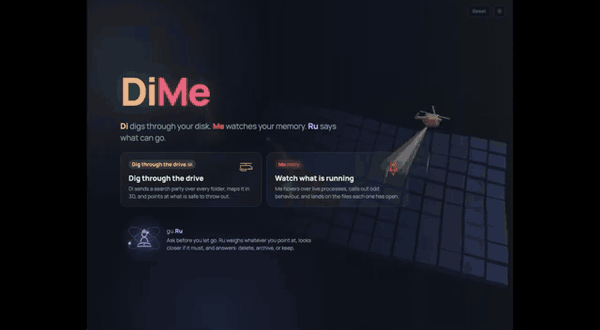

# DiMe

_Di_ digs through your disk. _Me_ watches your memory. _Ru_ gives sage advice. In the age of agents & models keep track of what's eating up your mac.

[](https://www.youtube.com/watch?v=CCvcYh9r6j4)

*Click for the full video.*

## Install

macOS only (it leans on FSEvents, nettop, lsof and IOKit). Apple silicon or Intel.

**Download the app**: grab `DiMe-<version>-macos.zip` from [Releases](https://github.com/pliablepixels/dime/releases), unzip it, drag `DiMe.app` to Applications, and open it. It runs in a window of its own on both Apple silicon and Intel.

The app is signed ad-hoc rather than notarized, so macOS quarantines it on first launch. Either right-click the app and choose Open, or clear the flag yourself:

```
xattr -dr com.apple.quarantine /Applications/DiMe.app
```

**Give it Full Disk Access.** System Settings > Privacy & Security > Full Disk Access, add `DiMe.app`. Without it, protected folders (Mail, Messages, Safari data, other users) quietly measure smaller than they are.

There is a command-line build too, `dime-<version>-macos.tar.gz`, which opens your browser instead of a window. Ru, the guru who validates what can go, needs one more thing either way: see **Optional, for Ru** below.

**Or build from source**:

1. **Rust** 1.85 or newer, if you do not have it:
   ```
   curl --proto '=https' --tlsv1.2 -sSf https://sh.rustup.rs | sh
   ```
2. **Build**:
   ```
   git clone <this repo> dime && cd dime
   cargo build --release
   ```
   Everything Rust needs is fetched by cargo, and Three.js and the webfont ship inside the binary, so nothing is downloaded at runtime. `make app` instead of `cargo build --release` gives you `dist/DiMe.app`.
3. **Optional, for Ru** (the guru who validates what can go), any one of:
   - the [Claude Code CLI](https://claude.ai/code): install, run `claude` once to log in. Ru gets a read-only tool allowlist.
   - the [Codex CLI](https://github.com/openai/codex): `npm i -g @openai/codex`, run `codex` once to log in. Ru runs in Codex's sandbox: reads everywhere, writes only to a scratch folder.
   - any OpenAI-compatible endpoint, including a local [Ollama](https://ollama.com): Ru then judges from what Di shows it, without shell tools.

   `jq` helps Ru trim Di's JSON and ships with recent macOS (`brew install jq` on older ones). With none of these, Di and Me work as usual and Ru is greyed out with a note.

## Run

```
open /Applications/DiMe.app  # or just double-click it
./target/release/dime        # from a shell: serves the same UI and opens your browser
```

The app runs in its own window. From a shell the binary opens http://127.0.0.1:4242 in your browser instead; add `--window` for the app window, or `--browser` inside the bundle to force the browser. `DIME_PORT=5000` picks another port. The startup line lists anything optional it could not find.

**Full Disk Access.** To scan folders macOS protects (Mail, Messages, Safari data, other users), grant it in System Settings → Privacy & Security → Full Disk Access: add `DiMe.app`, or your terminal app if you run the binary from a shell, then start DiMe again. Without it those folders simply show smaller, and Di says so in a banner once the scan finishes.

DiMe keeps its own files in `~/.dime`: the shelf (`shelf/`), remembered per-root state (`state.json`), the last map of each root (`snapshots/`) and Ru's read-only helper (`bin/di`). Delete the folder to reset everything except what is on the shelf, which you should put back or delete from the app first.

## What it does

**Di (disk)**: pick a drive or folder, Go. The map forms live while the scan runs (millions of files in seconds on a warm disk). Blocks are folders, area and height follow size, every folder carries an inset preview of its children. Colour by file type or by age. Click to explode into a folder, Esc to come back, right-click for Finder, Copy path, Hide, Send to Ru. The Cleanup tab leads with what is safe to free, in tiers (safe / probably safe / worth a look) with a plain-language reason for each item; rows unfold in place so you can tick things inside them. The idle slider narrows everything to files untouched for that long, and acting on a folder then moves only those files. Ticking adds to your **shortlist**, which is only a list; nothing moves. The shortlist is the one place anything happens, and it offers two things: **shelve** them, which moves them to `~/.dime/shelf` where they stay on the disk and can be put back at any time, or, behind a second confirmation, delete them for good. Shelving frees no space by itself; deleting from the shelf is the step that does. The scan root is watched, so changes on disk show within a couple of seconds. The last map of each root reopens instantly from a snapshot; Rescan refreshes it.

**Me (memory)**: a live dashboard, updated every 2 s. Totals for memory, CPU, GPU, network and disk IO. An odd-behaviour list that flags runaway or bursty CPU, heavy or bursty network, uploads, memory growth, disk hammering, and large idle processes, each with a plain sentence and how long it has been going on. Ranked lanes for CPU, GPU, Network and Disk IO with 60 s sparklines, plus the top memory holders. Click any process for a drawer with six sparklines, the app path, and its open files grouped by folder. Click a folder or file to land there on the disk map. Per-process GPU comes from Metal's accumulated GPU time in IOKit, no root needed.

**Ru (guru)**: Di finds, Ru validates. The gear at the top right picks what Ru thinks with: Auto (first of Claude, Codex, an endpoint), or one of them, or none. The endpoint form takes a URL, model, and key; `DIME_RU`, `DIME_RU_URL`, `DIME_RU_MODEL`, `DIME_RU_KEY` (or `OPENAI_API_KEY`) do the same from the environment. The choice is saved in `~/.dime/settings.json` and switches without a restart. The drawer header says which one is answering. Ask about the selection, the folder in view, or the shelf; Ru gets what Di knows about it, can query Di's index (`di tree`, `di flagged`, `di find`, `di idle`) and inspect the disk with read-only commands only, then answers with a verdict per item. A verdict becomes one button that applies the whole thing to your shortlist: what Ru says can go joins it, what Ru says to keep leaves it. Shelving and deleting still happen only from the shortlist. Drag rows or hold a block on the map to hand Ru something. Everything Ru is given is shown under "show what Ru sees".

## Your own rules

Di's rules for what can go are data, not code. See what ships:

```sh
dime --rules > ~/.dime/rules.toml
```

Edit that file. Your rules run before the built-ins, the first match wins, and `disable = ["downloads"]` switches a built-in off. Rescan to apply. A rule:

```toml
[[rule]]
id = "docker-images"        # groups items in the Cleanup panel
tier = "review"             # safe | likely | review
what = "Docker images"
note = "Pull again when needed. {idle}"
weight = 1.5                # score multiplier
dir = true                  # folders only; false = files only; omit = either
name = ["overlay2"]         # any of
parent_ends_with = "docker"
min_size = "500 MB"
min_age_days = 30
```

All matchers are optional and every one given must hold: `name`, `ext`, `parent_ends_with`, `under` (an ancestor folder's name), `has_child` (names directly inside), `has_sibling` and `no_sibling` (names beside it), `min_size`, `min_age_days`. `descend = true` marks a folder as a container to look inside rather than something to remove. The header of the built-in file documents each. A broken file is reported on stderr and ignored.

### Teaching DiMe a new tool

New model runners and coding agents appear constantly. Adding one is a rule, not a patch.

Say `newtool` keeps models in `~/.newtool/models`, one folder each, and removes them with `newtool remove <name>`:

```toml
[[rule]]
id = "newtool-model"
tier = "review"
what = "NewTool models"
note = "Pulled again on demand. {idle}"
dir = true
parent_ends_with = ".newtool/models"
min_size = "200 MB"
remove_with = "newtool remove {name}"
```

`remove_with` is the important line. Deleting such an item runs that command instead of unlinking files, so the tool's own index stays right: remove Ollama's blobs by hand and `ollama ls` goes on listing a model whose weights are gone. `{name}` is filled in with the folder's own name, the command is split into arguments and run without a shell, and shelving is refused for these, because there is no reversible half of a removal a tool performs itself. A command whose placeholders DiMe could not fill is never run.

For a coding agent, there is usually nothing to write at all. One rule covers every agent that keeps sessions and caches the same way, so a new one is a word:

```toml
under = [".claude", ".codex", ".gemini", ".yours"]
```

Two habits worth copying from the built-ins. Put anything a download cannot restore in `note`, which is inventory shown without a suggestion: transcripts, vector stores, training output. And split a tool's folder in two, so the disposable half is still offered while its memory is not.

What still needs code, in `src/gunk.rs`: naming a store that addresses files by hash rather than by name, as Ollama does, and noticing when its bookkeeping has gone stale. Everything else is data.

Backend: Rust (axum, rayon, sysinfo, notify), in a WKWebView window via wry. Frontend: one HTML + one JS file, no build step. Three.js and the webfont are vendored under `static/vendor` and baked into the binary, so DiMe never touches the network.
